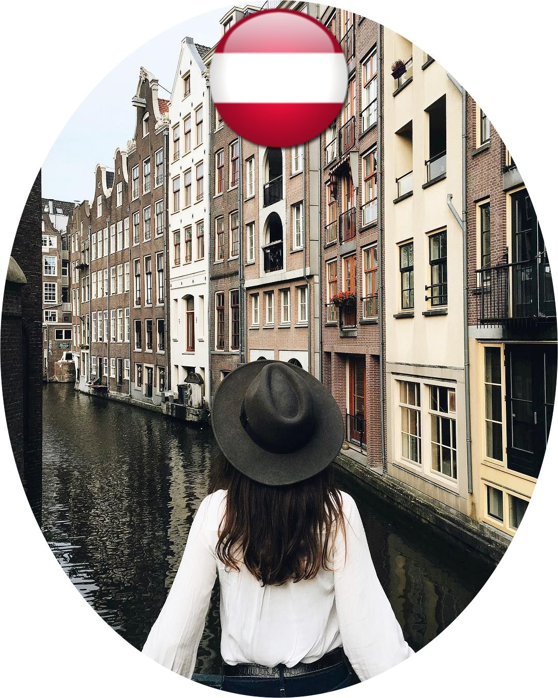

# Cloudinary's Guess the Transformation Challenge: JunctionX Vienna 2019

### This challenge involves guessing a Cloudinary transformation URL that produces a given target image from one \(or more\) given source image\(s\).

## Source Images:

#### Source image \#1: [https://res.cloudinary.com/demo/image/upload/vienna-3.jpg](https://res.cloudinary.com/demo/image/upload/vienna-3.jpg)

#### Source image \#2: [https://res.cloudinary.com/demo/image/upload/Austria-Flag-icon.png](https://res.cloudinary.com/demo/image/upload/Austria-Flag-icon.png)

#### 

## **W**arm-Up Transformation Example:

\*\*\*\*[**https://res.cloudinary.com/demo/image/r\_max/upload/l\_Austria-Flag-icon,g\_north,h\_300,w\_300/vienna-3.jpg**](https://res.cloudinary.com/demo/image/r_max/upload/l_Austria-Flag-icon,g_north,h_300,w_300/vienna-3.jpg)\*\*\*\*

## NOW YOU TRY! 😀



